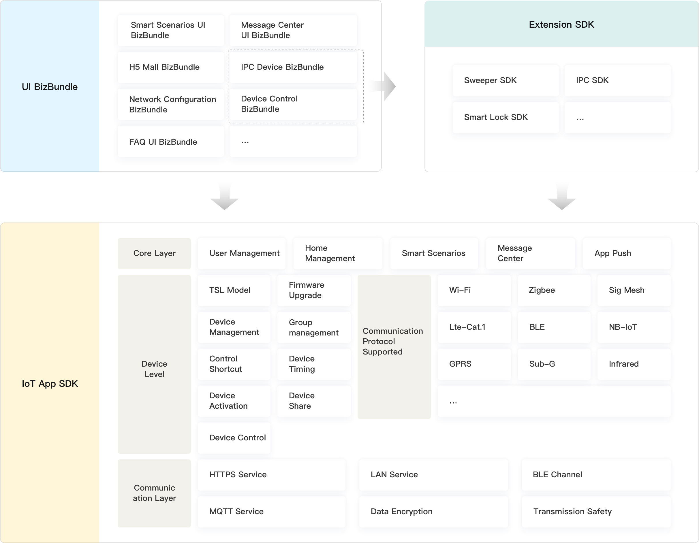

# Features Overview

## Home SDK

Home SDK is designed for the field of smart home provided by Tuya, avaliable for iOS 9.0 and above versions. iOS developers can quickly develop apps based on the SDK for smart device networking, control, firmware upgrades, timing tasks, smart scenes and more.

The SDK includes the following features:

- Account system (phone number, email registration, login, password reset and other general account functions)
- Home system (home management, room management, home sharing and other functions)
- Hardware functions (network configuration, control, status reporting, timed tasks, groups, firmware upgrades, sharing)

## Extension SDK

The IPC SDK, smart door lock SDK and sweeper SDK belong to the vertical category of SDK, which rely on the Home SDK. They mainly encapsulate the unique functions of the vertical category to facilitate the rapid development of the functions of the vertical category products.

The architecture design is as follows:

