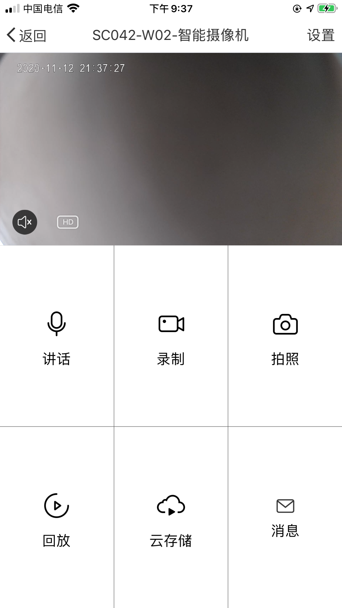
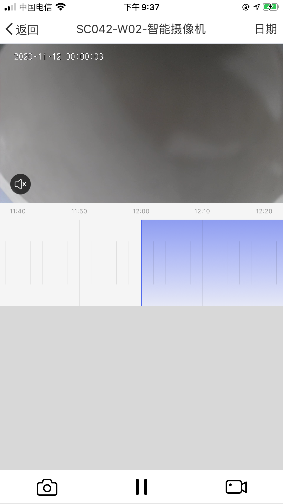
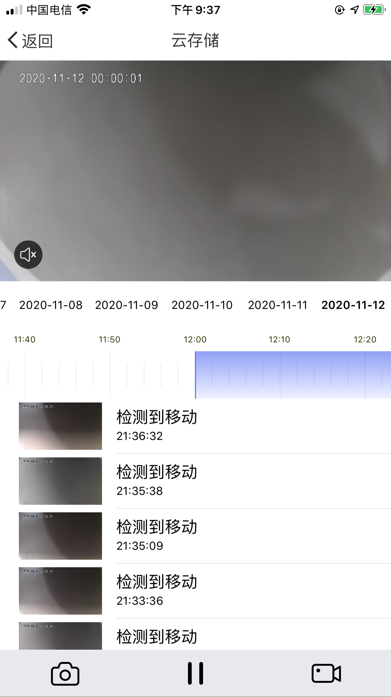
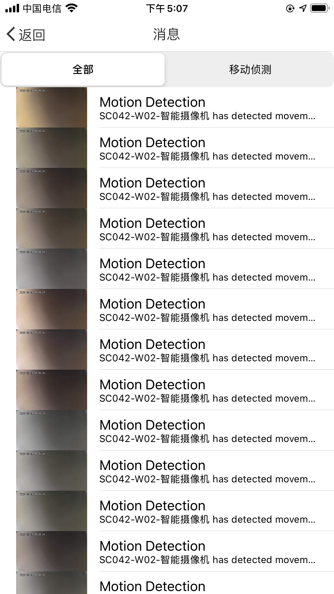
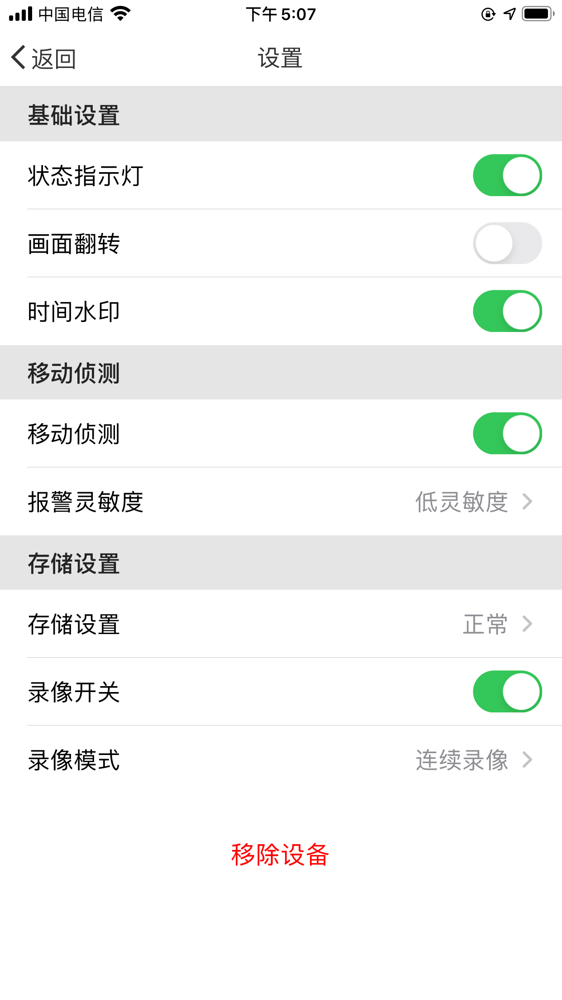

# Integrated SDK

## Integrated SDK

The IPC SDK depends on the user management, device configuration, home management, device management parts of the Home SDK, and on this basis, the functions of the smart camera device are realized.

**Modules**

| Module                | Description                         |
| --------------------- | ----------------------------------- |
| TuyaSmartActivatorKit | Device network configuration        |
| TuyaSmartCameraKit    | Tuya smart camera business core kit |

> `TuyaSmartCameraKit `is not a separate library, refer to [SDK Architecture](https://tuyainc.github.io/tuyasmart_camera_ios_sdk_doc/en/resource/architecture.html).

Add the following content in the `Podfile` file.

```ruby
platform :ios, '9.0'

target 'your_target_name' do

  pod "TuyaSmartActivatorKit"
	pod "TuyaSmartCameraKit"
	# pod "TuyaSmartCameraT"

end
```

If your App need to support p2p 1.0, need to add  `pod "TuyaSmartCameraT"`.

Then run the `pod update` command in the root directory of project. For use of CocoaPods, please refer to the [CocoaPods Guides](https://guides.cocoapods.org/). It is recommended to update the CocoaPods to the latest version.

## Initialize SDK

1. Open project setting, `Target => General`, edit `Bundle Identifier` to the value from Tuya develop center.

2. Import security image to the project and rename as `t_s.bmp`, then add it into `Project Setting => Target => Build Phases => Copy Bundle Resources`, refer to [Preparation for Integration](https://tuyainc.github.io/tuyasmart_home_ios_sdk_doc/en/resource/Preparation.html).

3. Add the following to the project file `PrefixHeader.pch`, Swift project add the following to the `xxx_Bridging-Header.h` file:

   ```objc
   #import <TuyaSmartBaseKit/TuyaSmartBaseKit.h>
   #import <TuyaSmartActivatorKit/TuyaSmartActivatorKit.h>
   #import <TuyaSmartCameraKit/TuyaSmartCameraKit.h>
   ```

4. Open file `AppDelegate.m`，and use the `App Key` and `App Secret` obtained from the development platform in the `[AppDelegate application:didFinishLaunchingWithOptions:]`method to initialize SDK:

   ObjC

   ```objc
   [[TuyaSmartSDK sharedInstance] startWithAppKey:<#your_app_key#> secretKey:<#your_secret_key#>];
   ```

   Swift

   ```swift
   TuyaSmartSDK.sharedInstance()?.start(withAppKey: <#your_app_key#>, secretKey: <#your_secret_key#>)
   ```

Now all the prepare work has been completed. You can use the sdk to develop your application now.

## Debug Mode

During the development we can open debug mode, print the log to analyze some problem.

ObjC

```objc
#ifdef DEBUG
    [[TuyaSmartSDK sharedInstance] setDebugMode:YES];
#else
#endif
```

Swift

```swift
#if DEBUG
   TuyaSmartSDK.sharedInstance()?.debugMode = true
#else
#endif

```

## Demo App

[IPC SDK Demo](https://github.com/TuyaInc/tuyasmart_camera_ios_sdk)

Refer to [Home SDK Demo App](https://tuyainc.github.io/tuyasmart_home_ios_sdk_doc/en/resource/Demo.html) introduction, configure `BundleId`, `AppKey`, `AppSecret`, and security picture correctly.

IPC SDK Demo App adds a control panel module for IPC device based on the functions of Home SDK Demo App.

* Live video panel: The p2p connection process of IPC device, live video, memory card recording, screenshots, intercom and other functions.
* Playback panel: The acquisition and playback of video clips in the device memory card, the use of timeline components.
* Cloud storage panel: Cloud storage service activation, status judgment, cloud storage video and cloud storage event acquisition and playback.
* Message panel: Acquisition and display of detect message.
* Setting panel: Use of IPC device standard dp points.

