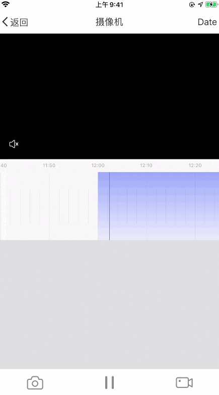

# Timeline View

When the timeline component uses video playback or cloud storage video playback, it linearly displays the video recording time points that can be played. You can slide the timeline to accurately locate the time point and segment to start playing. UI effects are as follows：




**Class and Protocol**

| Class (Protocol)         | Description                          |
| ------------------------ | ------------------------------------ |
| TuyaTimelineView         | Timeline view, inherited from UIView |
| TuyaTimelineViewDelegate | Timeline view delegate               |
| TuyaTimelineViewSource   | Timeline view datasource             |

## Introduction

### TuyaTimelineView

**Properties**

| Name                         | Type           | Description                                                  |
| ---------------------------- | -------------- | ------------------------------------------------------------ |
| spacePerUnit                 | CGFloat        | The width of a time unit, two long tick marks represent a time unit |
| unitMode                     | Enum           | Time unit mode, currently there are three, one time unit is 60 seconds, 600 seconds, 3600 seconds |
| tickMarkColor                | UIColor        | Color of tick mark                                           |
| backgroundGradientColors     | NSArray        | The gradient colors array of the timeline background color   |
| backgroundGradientLocations  | NSArray        | The gradient locations array of the timeline background color |
| contentColor                 | UIColor        | The data in the timeline is rendered in color. If a gradient is set, the gradient will be used for rendering |
| contentGradientColors        | NSArray        | The gradient colors array of the data rendering color in the timeline |
| contentGradientLocations     | NSArray        | The gradient locations array of the data rendering color in the timeline |
| timeHeaderHeight             | CGFloat        | The height of the time text field                            |
| timeTextTop                  | CGFloat        | The position of the time text on the Y axis, with timeHeaderHeight will determine the position of the data rendering |
| timeStringAttributes         | NSDictionary   | Time text string attributes                                  |
| showTimeText                 | BOOL           | Whether to display time text                                 |
| showShortMark                | BOOL           | Whether to show short tick marks                             |
| currentTime                  | NSTimeInterval | The currently selected time on the timeline, Unix timestamp  |
| date                         | NSDate         | Specified date                                               |
| timeZone                     | NSTimeZone     | Specified time zone                                          |
| isDragging                   | BOOL           | Is dragging                                                  |
| isDecelerating               | BOOL           | Is decelerating                                              |
| midLineColor                 | UIColor        | The color of the center line of the timeline                 |
| selectionBoxColor            | UIColor        | The color of the timeline selection box                      |
| selectedTimeRange            | NSRange        | Time range selected by the timeline selection box            |
| isSelectionEnabled           | BOOL           | Is in selection mode                                         |
| selectionTimeBackgroundColor | UIColor        | The background color of the time label of the timeline selection box |
| selectionTimeTextColor       | UIColor        | The text color of the time label of the timeline selection box |
| selectionTimeTextFontSize    | UIColor        | The text font size of the time label of the timeline selection box |
| sourceModels                 | NSArray        | Timeline view source data array                              |
| delegate                     | id             | Timeline view delegate                                       |

**Description**

Enable selection mode

```objc
- (void)enableSelectionModeWithMinLength:(NSInteger)min maxLength:(NSInteger)max;
```

**Parameters**

| Parameter | Type      | Description                                                  |
| --------- | --------- | ------------------------------------------------------------ |
| min       | NSInteger | The minimum length of time that the selection box can be selected |
| max       | NSInteger | The maximum length of time that the selection box can be selected |

**Description**

Exit selection mode and return to the selected time range

```objc
- (NSRange)finishSelection;
```

**Description**

Set the current time of the timeline. If the parameter `animated` passes `YES`, the timeline will slide to the corresponding time point at a constant speed and trigger `- (void)timelineView:didEndScrollingAtTime:inSource:` delegate method

```objc
- (void)setCurrentTime:(NSTimeInterval)currentTime animated:(BOOL)animated;
```

**Parameters**

| Parameter   | Type           | Description                      |
| ----------- | -------------- | -------------------------------- |
| currentTime | NSTimeInterval | The current time on the timeline |
| animated    | BOOL           | Is need animation effects        |

### TuyaTimelineViewDelegate

**Description**

Timeline starts to dragging

```objc
- (void)timelineViewWillBeginDragging:(TuyaTimelineView *)timeLineView;
```

**Description**

When the timeline ends dragging, `decelerate` is `YES`, which means the timeline is still sliding inertially

```objc
- (void)timelineViewDidEndDragging:(TuyaTimelineView *)timeLineView willDecelerate:(BOOL)decelerate;
```

**Description**

The timeline slides to a certain point in time, `isDragging` is `YES` indicating that the timeline is being dragged

```objc
- (void)timelineViewDidScroll:(TuyaTimelineView *)timeLineView time:(NSTimeInterval)timeInterval isDragging:(BOOL)isDragging;
```

**Description**

The timeline stops sliding, `timeInterval` represents the time point when the timeline last stopped, and `source` represents the data source containing this time point

```objc
- (void)timelineView:(TuyaTimelineView *)timeLineView didEndScrollingAtTime:(NSTimeInterval)timeInterval inSource:(id<TuyaTimelineViewSource>)source;
```

**Description**

The timeline view is scaled, `unitMode` represents the current time unit mode

```objc
- (void)timelineView:(TuyaTimelineView *)timeLineView scaleToUnitMode:(TuyaTimelineUnitMode)unitMode;
```

### TuyaTimelineViewSource

The data source protocol has only two interfaces to get the start time point and end time point of this fragment.

**Description**

Start time, need to return the number of seconds relative to the parameter `date`

```objc
- (NSTimeInterval)startTimeIntervalSinceDate:(NSDate *)date;
```

**Description**

End time, need to return the number of seconds relative to the parameter `date`

```objc
- (NSTimeInterval)stopTimeIntervalSinceDate:(NSDate *)date;
```

> The timeline is used to render time segments that do not overlap in a day. For the sample code, please refer to the `TYCameraTimeLineModel.m` and `TYDemoCameraPlaybackViewController.m` files in the Demo.