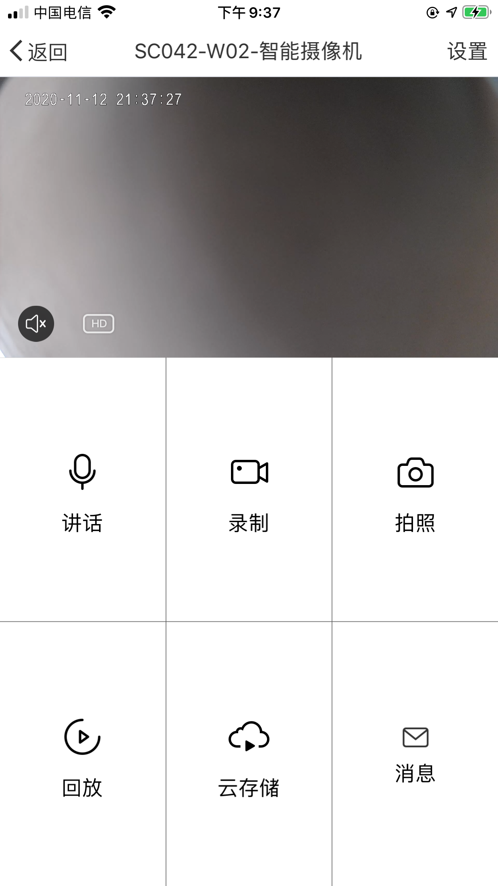
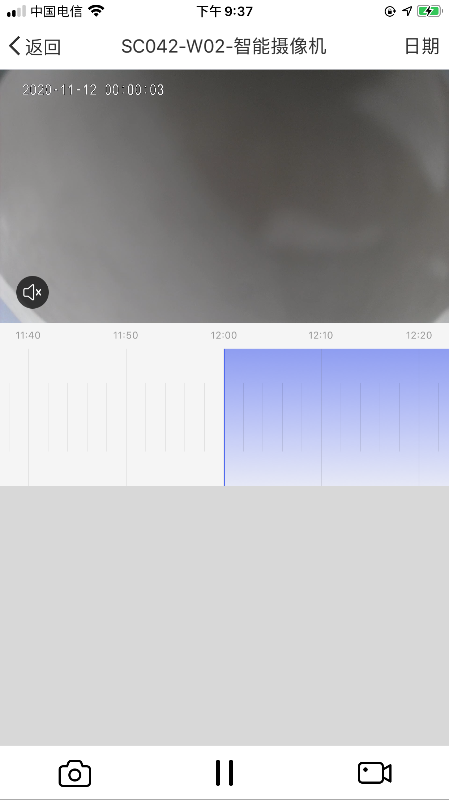
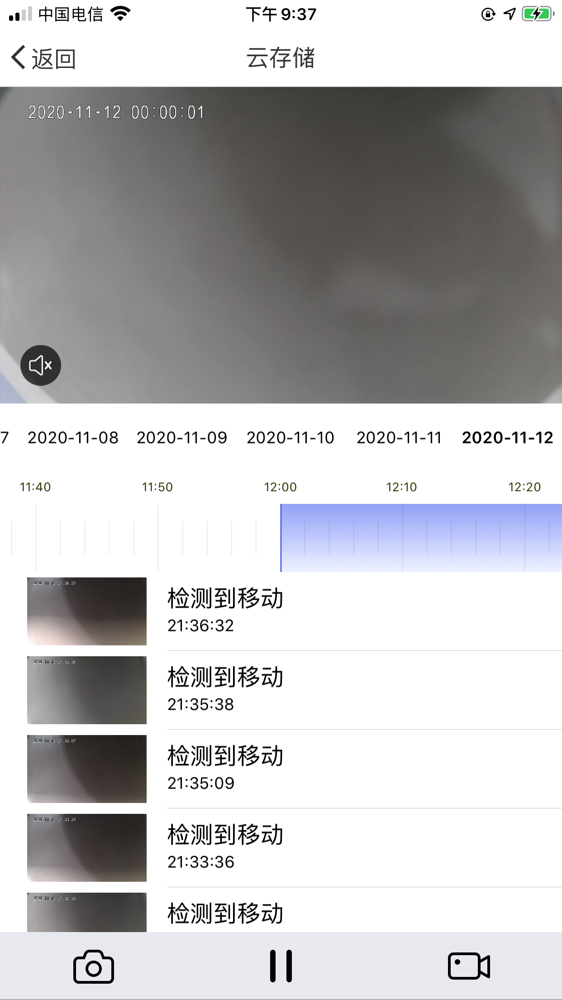
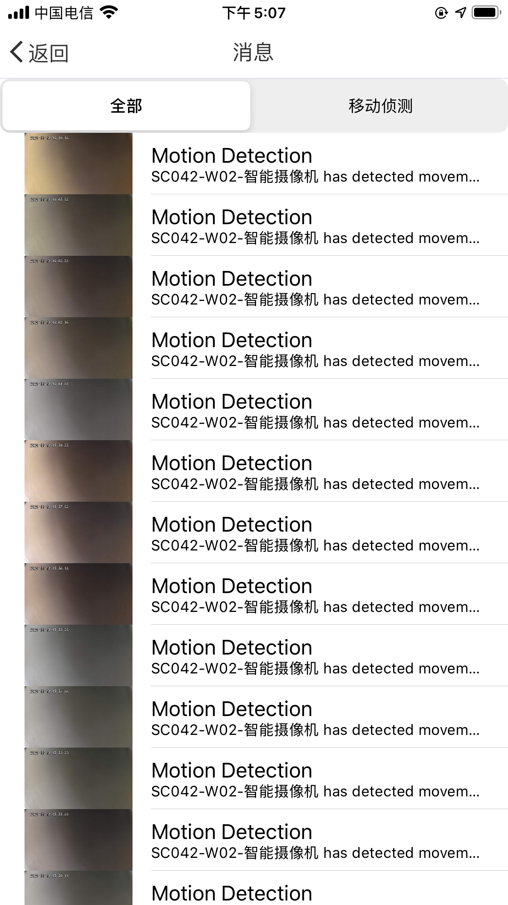
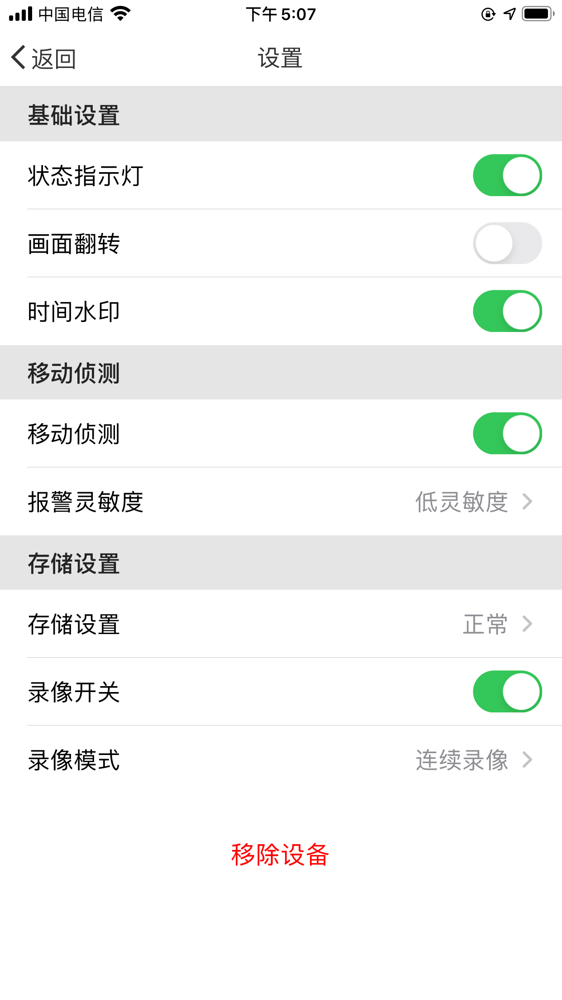

## 集成 SDK

### 快速集成

IPC SDK 依赖 Home SDK 中用户管理，设备配网，家庭管理，设备管理等部分，在此基础上实现了智能摄像机设备的功能。

SDK 最低支持系统版本 9.0。IPC 设备不支持云云对接，必须使用 IPC SDK 和 Home SDK。

**模块说明**

| 模块名                | 说明                         |
| --------------------- | ---------------------------- |
| TuyaSmartActivatorKit | 设备配网 SDK                 |
| TuyaSmartCameraKit    | 涂鸦智能摄像机垂直化功能 SDK |

> `TuyaSmartCameraKit`不只是一个单独的库，还会依赖到其他基础功能支撑的库，可以参考 [SDK 架构说明](https://tuyainc.github.io/tuyasmart_camera_ios_sdk_doc/zh-hans/resource/architecture.html)。

在```Podfile```文件中添加以下内容：

```ruby
platform :ios, '9.0'

target 'your_target_name' do

  pod "TuyaSmartActivatorKit"
	pod "TuyaSmartCameraKit"
	# pod "TuyaSmartCameraT"

end
```

如果您需要支持 p2p 1.0 的设备，需要增加 `pod "TuyaSmartCameraT"`, 然后在项目根目录下执行```pod update```命令。

CocoaPods的使用请参考：[CocoaPods Guides](https://guides.cocoapods.org/)

### 初始化 SDK

1. 打开项目设置，Target => General，修改```Bundle Identifier```为涂鸦开发者平台上注册的 App 对应的 iOS 包名。

2. 将[准备工作](https://tuyainc.github.io/tuyasmart_home_ios_sdk_doc/zh-hans/resource/Preparation.html)中下载的安全图片导入到工程根目录，重命名为```t_s.bmp```，并加入「项目设置 => Target => Build Phases => Copy Bundle Resources」中。

3. 在项目的```PrefixHeader.pch```文件添加以下内容（Swift 项目可以添加在```xxx_Bridging-Header.h```桥接文件中）：

   ```objc
   #import <TuyaSmartBaseKit/TuyaSmartBaseKit.h>
   #import <TuyaSmartActivatorKit/TuyaSmartActivatorKit.h>
   #import <TuyaSmartCameraKit/TuyaSmartCameraKit.h>
   ```

4. 打开`AppDelegate.m`文件，在`[AppDelegate application:didFinishLaunchingWithOptions:]`方法中，使用在涂鸦开发者平台上，App 对应的 `App Key`，`App Secret` 初始化SDK：

   ObjC

   ```objc
   [[TuyaSmartSDK sharedInstance] startWithAppKey:<#your_app_key#> secretKey:<#your_secret_key#>];
   ```

   Swift

   ```swift
   TuyaSmartSDK.sharedInstance()?.start(withAppKey: <#your_app_key#>, secretKey: <#your_secret_key#>)
   ```

至此，涂鸦智能 App SDK 已经成功激活，可以开始 App 开发了。

### Debug 模式

在开发的过程中可以开启 Debug 模式，打印一些日志用于分析问题。

ObjC

```objc
#ifdef DEBUG
    [[TuyaSmartSDK sharedInstance] setDebugMode:YES];
#else
#endif
```

Swift

```swift
#if DEBUG
   TuyaSmartSDK.sharedInstance()?.debugMode = true
#else
#endif

```

### Demo App

[IPC SDK Demo 链接](https://github.com/TuyaInc/tuyasmart_camera_ios_sdk)

参考[Home SDK Demo App](https://tuyainc.github.io/tuyasmart_home_ios_sdk_doc/zh-hans/resource/Demo.html)的简介，将 `BundleId`、 `AppKey`、`AppSecret`、安全图片配置正确。

IPC SDK Demo App 在 Home SDK Demo App 的功能基础上，增加了 IPC 设备的控制面板模块。

* 直播页面：IPC 设备的 p2p 连接流程，实时视频播放，视频录制、截图、对讲等功能。
* 回放页面：设备存储卡中视频片段的获取与播放，时间轴组件的使用。
* 云存储页面：云存储服务的开通，状态判断，云存储视频和云存储事件的获取与播放。
* 消息页面：告警事件的获取与展示。
* 设置页面：IPC 设备标准 dp 功能点的使用。

