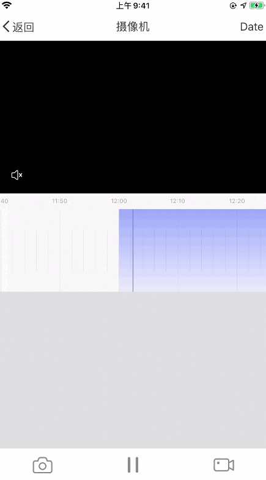

# 时间轴组件

时间轴组件用视频回放或者云存储视频回放时，线性展示可以播放的视频录像时间点。可以通过滑动时间轴来精准的定位开始播放的时间点和片段。UI 效果如下：




**类和协议**

| 类（协议）名             | 描述                         |
| ------------------------ | ---------------------------- |
| TuyaTimelineView         | 时间轴视图类，继承自`UIView` |
| TuyaTimelineViewDelegate | 时间轴视图代理协议           |
| TuyaTimelineViewSource   | 时间轴数据源协议             |

## 接口说明

### TuyaTimelineView

**属性**

| 名称                         | 类型           | 说明                                                         |
| ---------------------------- | -------------- | ------------------------------------------------------------ |
| spacePerUnit                 | CGFloat        | 一个时间单位的宽，两条长刻度线表示一个时间单位               |
| unitMode                     | Enum           | 时间单位模式，目前有三种，一个时间单位为 60 秒，600 秒，3600 秒 |
| tickMarkColor                | UIColor        | 刻度线的颜色                                                 |
| backgroundGradientColors     | NSArray        | 时间轴背景颜色的渐变色数组                                   |
| backgroundGradientLocations  | NSArray        | 时间轴背景颜色的渐变着色点数组                               |
| contentColor                 | UIColor        | 时间轴中的数据渲染颜色，如果设置了渐变色，将使用渐变色渲染   |
| contentGradientColors        | NSArray        | 时间轴中的数据渲颜色的渐变色数组                             |
| contentGradientLocations     | NSArray        | 时间轴中的数据渲颜色的渐变着色点数组                         |
| timeHeaderHeight             | CGFloat        | 时间文本栏的高度                                             |
| timeTextTop                  | CGFloat        | 时间文本在 Y 轴上的位置，和 timeHeaderHeight 将决定数据渲染的位置 |
| timeStringAttributes         | NSDictionary   | 时间文本的属性                                               |
| showTimeText                 | BOOL           | 是否显示时间文本                                             |
| showShortMark                | BOOL           | 是否显示短刻度线                                             |
| currentTime                  | NSTimeInterval | 时间轴当前选中的时间，Unix 时间戳                            |
| date                         | NSDate         | 指定的日期                                                   |
| timeZone                     | NSTimeZone     | 指定的时区                                                   |
| isDragging                   | BOOL           | 是否正在拖拽中                                               |
| isDecelerating               | BOOL           | 是否正在惯性滑动中                                           |
| midLineColor                 | UIColor        | 时间轴中间标线的颜色                                         |
| selectionBoxColor            | UIColor        | 时间轴选择框的颜色                                           |
| selectedTimeRange            | NSRange        | 时间轴选择框选中的时间范围                                   |
| isSelectionEnabled           | BOOL           | 是否在选择模式中                                             |
| selectionTimeBackgroundColor | UIColor        | 时间轴选择框时间标签的背景颜色                               |
| selectionTimeTextColor       | UIColor        | 时间轴选择框时间标签的文本颜色                               |
| selectionTimeTextFontSize    | UIColor        | 时间轴选择框时间标签的文本字体大小                           |
| sourceModels                 | NSArray        | 时间轴源数据数组                                             |
| delegate                     | id             | 时间轴代理                                                   |

**接口说明**

开启时间选择模式

```objc
- (void)enableSelectionModeWithMinLength:(NSInteger)min maxLength:(NSInteger)max;
```

**参数说明**

| 参数 | 类型      | 说明                       |
| ---- | --------- | -------------------------- |
| min  | NSInteger | 选择框能选中的最小时间长度 |
| max  | NSInteger | 选择框能选中的最大时间长度 |

**接口说明**

退出选择模式，返回选中的时间范围

```objc
- (NSRange)finishSelection;
```

**接口说明**

设置时间轴的当前时间，如果参数 `animated` 传 `YES`，时间轴会匀速滑动到对应的时间点，并且会触发 `- (void)timelineView:didEndScrollingAtTime:inSource:` 代理方法

```objc
- (void)setCurrentTime:(NSTimeInterval)currentTime animated:(BOOL)animated;
```

**参数说明**

| 参数        | 类型           | 说明               |
| ----------- | -------------- | ------------------ |
| currentTime | NSTimeInterval | 时间轴当前的时间点 |
| animated    | BOOL           | 是否需要动画效果   |

### TuyaTimelineViewDelegate

**接口说明**

时间轴开始拖拽

```objc
- (void)timelineViewWillBeginDragging:(TuyaTimelineView *)timeLineView;
```

**接口说明**

时间轴结束拖拽，`decelerate` 为 `YES` 表示时间轴还在继续惯性滑动

```objc
- (void)timelineViewDidEndDragging:(TuyaTimelineView *)timeLineView willDecelerate:(BOOL)decelerate;
```

**接口说明**

时间轴滑动到某个时间点，`isDragging` 为`YES`表示时间轴正在被拖拽中

```objc
- (void)timelineViewDidScroll:(TuyaTimelineView *)timeLineView time:(NSTimeInterval)timeInterval isDragging:(BOOL)isDragging;
```

**接口说明**

时间轴停止滑动，`timeInterval`表示时间轴最后停止的时间点，`source`表示包含这个时间点的数据源

```objc
- (void)timelineView:(TuyaTimelineView *)timeLineView didEndScrollingAtTime:(NSTimeInterval)timeInterval inSource:(id<TuyaTimelineViewSource>)source;
```

**接口说明**

时间轴被缩放，`unitMode`表示当前的时间单位模式

```objc
- (void)timelineView:(TuyaTimelineView *)timeLineView scaleToUnitMode:(TuyaTimelineUnitMode)unitMode;
```

### TuyaTimelineViewSource

数据源协议只有两个接口，用来获取这个片段的开始时间点和结束时间点。

**接口说明**

开始时间，需要返回相对于参数 `date` 的秒数

```objc
- (NSTimeInterval)startTimeIntervalSinceDate:(NSDate *)date;
```

**接口说明**

结束时间，需要返回相对于参数 `date` 的秒数

```objc
- (NSTimeInterval)stopTimeIntervalSinceDate:(NSDate *)date;
```

> 时间轴用于渲染一天中并不重叠的时间片段，示例代码请参考 Demo 中的 `TYCameraTimeLineModel.m` 和 `TYDemoCameraPlaybackViewController.m` 文件。